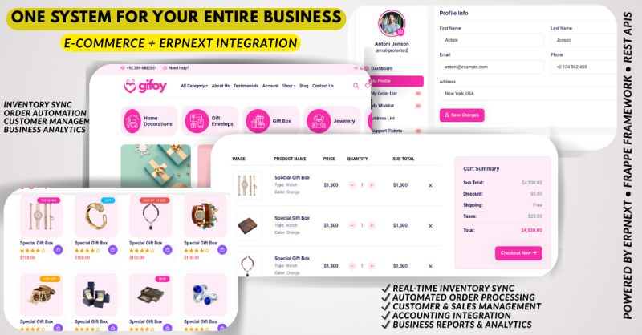

<!-- ╔════════════════════════════════════════════════════════════════[...]
     ║        HASSAN ALI  ·  FRAPPE / ERPNEXT ARCHITECT               ║
     ║        hassan0703  ·  Lahore, Pakistan                          ║
     ╚════════════════════════════════════════════════════════════════[...]

<!-- ━━━━━━━━━━━━━━━━━━━━  HERO  ━━━━━━━━━━━━━━━━━━━━ -->
<div align="center">


<!-- ━━━━━━━━━━━━━━━━━━━━  SNAKE  ━━━━━━━━━━━━━━━━━━━━ -->
<picture>
  <source media="(prefers-color-scheme: dark)"
    srcset="https://raw.githubusercontent.com/Hassan0703/Hassan0703/output/github-contribution-grid-snake-dark.svg"/>
  <source media="(prefers-color-scheme: light)"
    srcset="https://raw.githubusercontent.com/Hassan0703/Hassan0703/output/github-contribution-grid-snake.svg"/>
  
</picture>

---

<!-- ━━━━━━━━━━━━━━━━━━━━  WAVE DIVIDER  ━━━━━━━━━━━━━━━━━━━━ -->
<div align="center">

</div>

<br/>

<!-- ━━━━━━━━━━━━━━━━━━━━  IDENTITY SPLIT  ━━━━━━━━━━━━━━━━━━━━ -->
<table width="100%" border="0">
<tr>
<td width="53%" valign="top">

### 🧬 System Config

```yaml
# hassan_ali.runtime.yml
profile:
  name:      Hassan Ali
  handle:    Hassan0703
  role:      Frappe / ERPNext Architect
  company:   NexTash · Lahore, Pakistan
  markets:   [Pakistan, Gulf Region]
  timezone:  PKT  UTC+5
  status:    🟢  Open for projects

core_stack:
  backend:   [Python, Frappe, ERPNext, MariaDB, Redis]
  frontend:  [Vue 3, JavaScript, HTML5, CSS3, Jinja2]
  devops:    [Linux, Nginx, Docker, Bench CLI]
  output:    [wkhtmltopdf, PDF, Print Formats]

active_builds:
  lushaka_core: Property Rental ERP      # 🔨
  TradeFlow:    Commodity Trading ERP    # 🔨
  Frapxel:      Branded Invoice System   # ✅
  ERPNova_UI:   Vue 3 Frappe UI Kit      # ✅
```

</td>
<td width="2%"></td>
<td width="45%" valign="top">

### 📡 Activity


</tr>
</table>

<br/>

---

<!-- ━━━━━━━━━━━━━━━━━━━━  SKILLS  ━━━━━━━━━━━━━━━━━━━━ -->
<div align="center">

## ⚡ Tech Arsenal


<br/><br/>

<!-- FRAPPE ECOSYSTEM PILLS -->
&ensp;![ERPNext](https://img.shields.io/badge/ERPNext-050d[...]

</div>

<br/>

---

<!-- ━━━━━━━━━━━━━━━━━━━━  SHOWCASE PROJECT  ━━━━━━━━━━━━━━━━━━━━ -->
## 🖼️ Project Showcase

<!-- GIFOY ECOMMERCE — with real screenshot -->
<div align="center">

### Gifoy Shop — Ecommerce × Frappe Integration

<a href="https://github.com/Hassan0703/Gifoy-shop-Ecommerce-Store-Frape-Integration">
  
</a>

<br/><sub>🛒 Storefront with live Frappe/ERPNext backend · HTML · CSS · Frappe Integration</sub>

</div>

<br/>

<!-- PROJECT CARD GRID -->
<div align="center">

<a href="https://github.com/Hassan0703/NxT-Car-Rental-Management">
  
</a>&ensp;
<a href="https://github.com/Hassan0703/everest-invoice-system">
  

<br/>

<a href="https://github.com/Hassan0703/Custom-Namming-Series">
  &ensp;
<a href="https://github.com/Hassan0703/Nexilo-Website---Frontend-Only-">
  

</div>

<br/>

<!-- ACTIVE BUILDS TABLE -->
<div align="center">

| | Project | What It Does | Stack | Status |
|:--:|---------|-------------|-------|:------:|
| 🏠 | **lushaka_core** | Property Rental ERP — `Property` doctype, file upload logging, Project dashboard overrides | `Frappe` `Python` `Jinja2` | 🔨 Building |
| 🌾 | **TradeFlow** | Rice import/export ERP — 4-phase: Master Data → Procurement → Logistics → Sales/Finance | `ERPNext` `Python` | 🔨 Building |
| 🧾 | **Frapxel** | Branded ERPNext invoice system for Pakistan & Gulf SME clients | `Jinja2` `HTML/CSS` `PDF` | ✅ Live |
| 🎨 | **ERPNova UI** | Vue 3 UI kit — Pinia stores, CSS design tokens, SVG charts, command palette | `Vue 3` `CSS` | ✅ Live |
| 📋 | **Elektro Serviceteam** | Multi-page invoice/quotation print formats for Austrian electrical firm | `Jinja2` `wkhtmltopdf` | ✅ Delivered |

</div>

<br/>

---

<!-- ━━━━━━━━━━━━━━━━━━━━  STATS  ━━━━━━━━━━━━━━━━━━━━ -->
<div align="center">

## 📊 Numbers

<br/>

<!-- TROPHIES -->


<br/><br/>

<!-- METRICS OVERVIEW via github-readme-stats additional cards -->


</div>

<br/>

---

<!-- ━━━━━━━━━━━━━━━━━━━━  ASCII ARCHITECTURE  ━━━━━━━━━━━━━━━━━━━━ -->
## 🧠 How I Think

```
╔═══════════════════════════════════════════════════════════════════[...]
║                                                                       ║
║   Most developers build features. I build systems.                    ║
║                                                                       ║
║   CLIENT NEED                                                         ║
║       │                                                               ║
║       ▼                                                               ║
║   ┌─────────────┐    ┌──────────────┐    ┌───────────────┐           ║
║   │  Discovery  │───▶│  Frappe App  │───▶│  ERPNext ERP  │           ║
║   │  & Mapping  │    │  Custom Dev  │    │  Full Rollout │           ║
║   └─────────────┘    └──────────────┘    └───────────────┘           ║
║                              │                                        ║
║          ┌───────────────────┼───────────────────┐                   ║
║          ▼                   ▼                   ▼                   ║
║   ┌────────────┐    ┌─────────────┐    ┌─────────────┐               ║
║   │  Jinja2    │    │   Vue 3     │    │  MariaDB    │               ║
║   │  Print     │    │   UI Kit   │    │  Schemas    │               ║
║   │  Formats   │    │   Tokens   │    │  & Queries  │               ║
║   └────────────┘    └─────────────┘    └─────────────┘               ║
║                                                                       ║
║   End result: spreadsheet hell  →  structured ERP system             ║
║                                                                       ║
╚═══════════════════════════════════════════════════════════════════[...]
```

<br/>

---

<!-- ━━━━━━━━━━━━━━━━━━━━  ANIMATED WAVE METRICS  ━━━━━━━━━━━━━━━━━━━━ -->
<div align="center">

## 🌊 Contribution Wave


&ensp;

&ensp;


</div>

<br/>

---

<!-- ━━━━━━━━━━━━━━━━━━━━  CONNECT  ━━━━━━━━━━━━━━━━━━━━ -->
<div align="center">

## 🌐 Let's Build Together

[](https://www.linkedin.com/in/hassan-ali-frappe-dev/)
&ensp;
[](https://www.instagram.com/hassan_______47)
&ensp;
[](https://github.com/Hassan0703)

<br/><br/>


&ensp;
[](https://github.com/Hassan0703?tab=followers)

<br/><br/>

```
┌─────────────────────────────────────────────────────────────────══[...]
│   Building something with Frappe or ERPNext?                    │
│   Need a custom app, print format, or full ERP rollout?         │
│                                                                 │
│   → linkedin.com/in/hassan-ali-frappe-dev                       │
└─────────────────────────────────────────────────────────────────══[...]
```

</div>

<br/>

---

<!-- ━━━━━━━━━━━━━━━━━━━━  FOOTER  ━━━━━━━━━━━━━━━━━━━━ -->

